# Integração com o Facebook
___

Giuliana Marquesi

Vinicius Baptista

## Conta desenvolvedor

### Criar ID do projeto
Na página de [Desenvolvedor do Facebook](https://developers.facebook.com/apps)

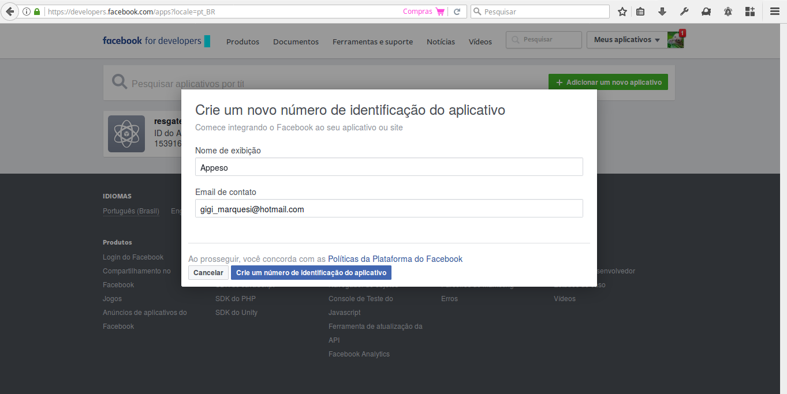

### Criar ID do projeto
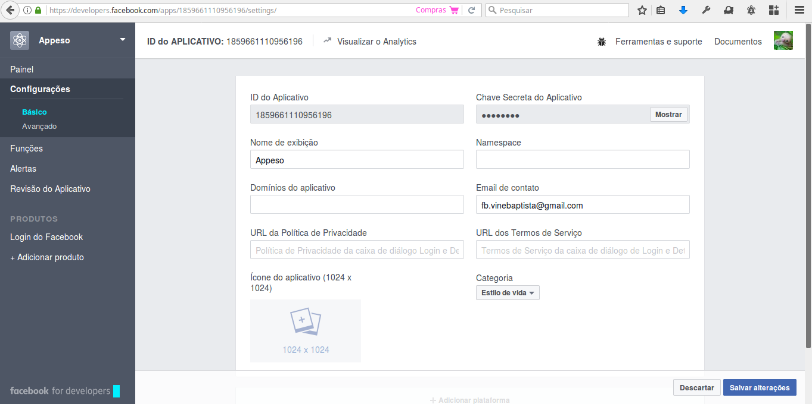

### Configurar a conta

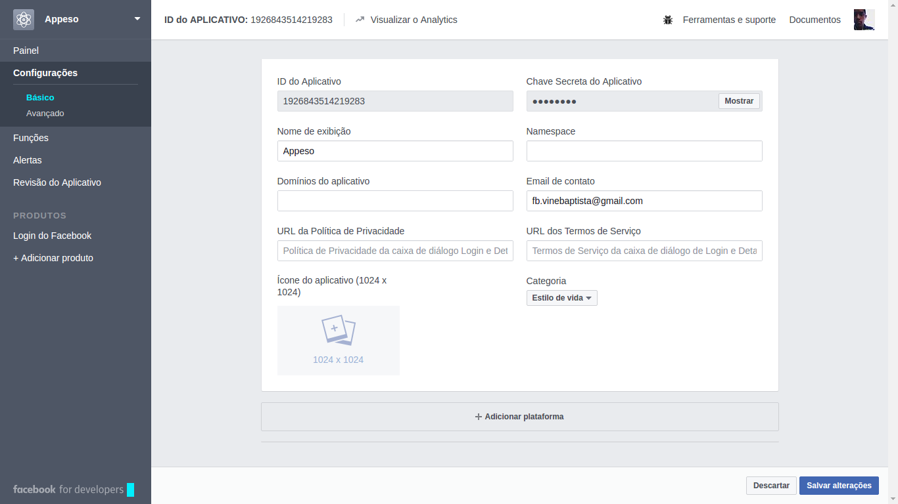

### Configurar a conta

Adicionar a plataforma Android:

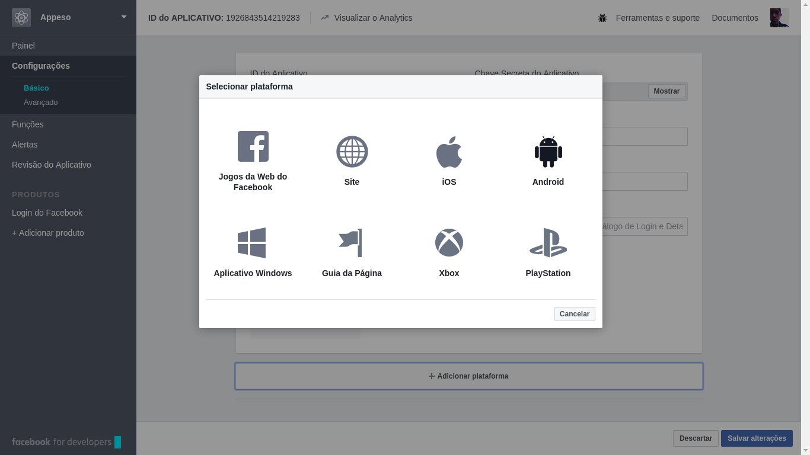

### Configurar a conta

Preencher com os dados necessários:

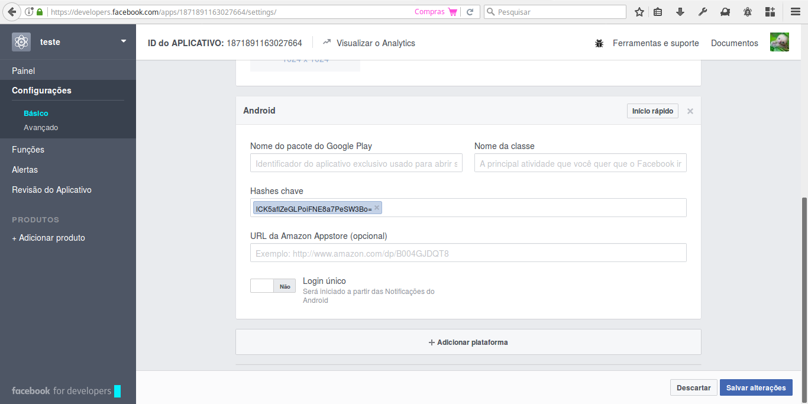

### Obter a hash

**ESTE É UM PASSO EXTREMAMENTE IMPORTANTE**

. . .

- No diretório [doc](https://github.com/jeduan/cordova-plugin-facebook4/tree/master/docs/android) do plugin, existem tutoriais para cada plataforma.

. . .

- Para obter a hash necessária para a autenticação do app Android deve-se seguir os passos:
  * No diretório do projeto, digitar o seguinte comando que gerará uma hash de desenvolvimento para o app:

~~~bash
  keytool -exportcert -alias Appeso -keystore ~/.android/debug.keystore | openssl sha1 -binary | openssl base64
~~~

. . .

- **MAS** quando for para produção deverá ser criada nova hash a partir de uma keystore associada ao Android, Google Play.

## Plugin

### Pesquisa

É possível encontrar plugins cordova em uma página própria do [projeto](https://cordova.apache.org/plugins/?q=facebook&platforms=cordova-android)

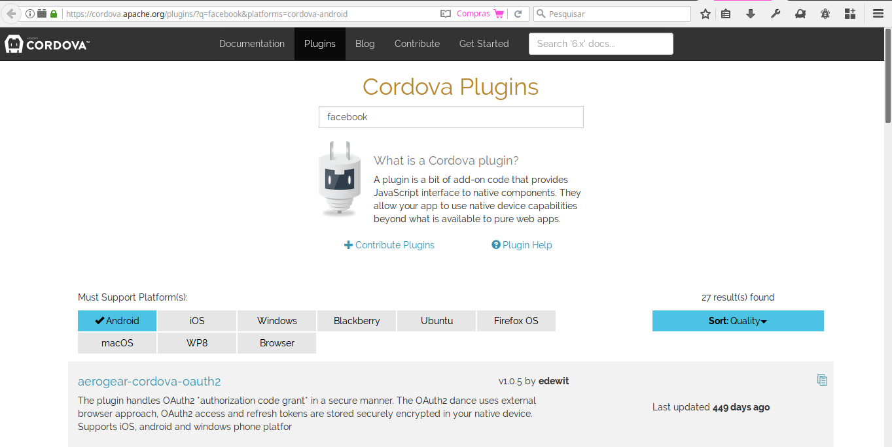

### Pesquisa

- Essa pesquisa rendeu 27 plugins encontrados que redirecionavam, a maioria, para a página do NPM.

. . .

- O projeto dito como oficial do Facebook pode ser encontrado em diversos pacotes NPM de diferentes usuários, mas que levam à mesma referência:
[https://github.com/Wizcorp/phonegap-facebook-plugin/](https://github.com/Wizcorp/phonegap-facebook-plugin/)

. . .

- Seguimos o README do repositório git para instalar e rodar os primeiros métodos.

### Instalação do plugin

**IMPORTANTE: Este plugin só é suportado até a versão do Android 5.**

. . .

- É possível instalar um _fork_ do plugin com base na versão  mais recente da API do [Facebook, 4]( https://github.com/jeduan/cordova-plugin-facebook4). Ele possui suporte para o Android 6 e 7.

. . .

- Caso possua versões 6 e 7 do Android é possível também _marcar_ a versão 5 como a plataforma escolhida para o projeto cordova ao adicionar a plataforma:

```bash
  cordova platform add android@5.1.1
```

### Instalação do plugin

- Para instalar o plugin.

. . .

No diretório do projeto, digitar o comando que inclui o plugin:

~~~bash
cordova -d plugin add phonegap-facebook-plugin --variable APP_ID="APP_ID" --variable APP_NAME="NOME_APP"
~~~

. . .

APP_ID

: É o ID gerado quando criada a aplicação, aparece logo de inicio na tela

NOME_APP

: É o nome que foi definido quando criado o app na sessão de desenvolvedor

Ambos são encontrados na pare de configurações da sessão do desenvolvedor.

## Métodos utilizados

### Documentação

Além da documentação do Plugin, outra boa fonte é o site oficial da API do Facebook.

Encontrado no site [developers do Facebook](https://developers.facebook.com/docs/facebook-login/web)

### getLoginStatus

~~~javascript
FB.getLoginStatus(function(response) {
    statusChangeCallback(response);
});
~~~

Retorna o objeto:

```javascript
{
	authResponse: {
		userID: "12345678912345",
		accessToken: "kgkh3g42kh4g23kh4g2kh34g2kg4k2h4gkh3g4k2h4gk23h4gk2h34gk234gk2h34AndSoOn",
		session_Key: true,
		expiresIn: "5183738",
		sig: "..."
	},
	status: "connected"
}
```

### getLoginStatus

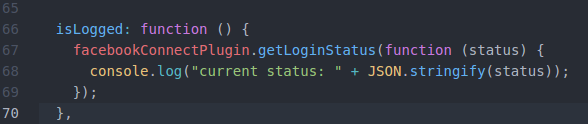

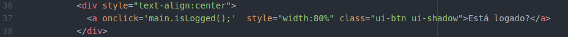

### login

~~~javascript
facebookConnectPlugin.logout(Function success, Function failure)
~~~

Retorna o objeto:

~~~javascript
{
	status: "connected",
	authResponse: {
		session_key: true,
		accessToken: "<long string>",
		expiresIn: 5183979,
		sig: "...",
		secret: "...",
		userID: "634565435"
	}
}
~~~

### login

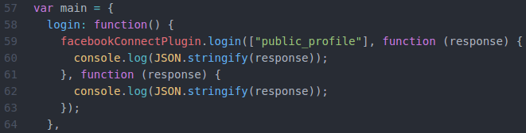

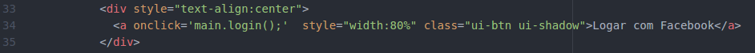

### showDialog

~~~javascript
facebookConnectPlugin.showDialog(options,
				function (result) {
    				alert("Posted. " + JSON.stringify(result));				},
    		function (e) {
				alert("Failed: " + e);
			});
~~~


### showDialog

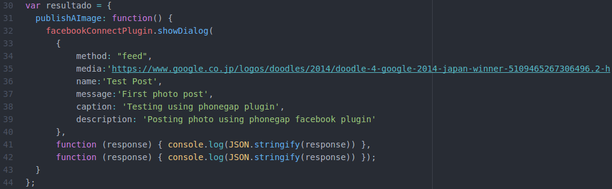

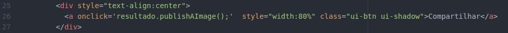

## Avaliação do plugin

### Prós
- Não é necessário conhecimento sobre conexões remotas e todo seu funcionamento.
- É só usar os métodos disponíveis pela API.

### Contras
- O plugin é apegado a determinadas versões do Cordova.
- O plugin é apegado a determinadas versões do Android.
- Logo, não é possivel usar as versões independentes das coisas.
- Não é possivel usar a versão mais recente da API.
- Documentação ainda rudimentar, várias páginas com mesmo conteúdo e poucas instruções mais profundas.

## Links
### Links

Facebook developers painel do App

: [https://developers.facebook.com/apps](https://developers.facebook.com/apps)

Pesquisador de plugins Cordova

: [https://cordova.apache.org/plugins/?q=facebook&platforms=cordova-android](https://cordova.apache.org/plugins/?q=facebook&platforms=cordova-android)

Github do plugin oficial do da API da facebook

: [https://github.com/Wizcorp/phonegap-facebook-plugin/](https://github.com/Wizcorp/phonegap-facebook-plugin/)

Github do fork da API 4 do Facebook

: [https://github.com/jeduan/cordova-plugin-facebook4](https://github.com/jeduan/cordova-plugin-facebook4)

### Links

Documentação Facebook developers

: [https://developers.facebook.com/docs/facebook-login/web](https://developers.facebook.com/docs/facebook-login/web)

Documentação do plugin para Android

: [https://github.com/jeduan/cordova-plugin-facebook4/tree/master/docs/android](https://github.com/jeduan/cordova-plugin-facebook4/tree/master/docs/android)

Documentação sobre Android no Facebook, como criar hash

: [https://developers.facebook.com/docs/android/getting-started#release-key-hash](https://developers.facebook.com/docs/android/getting-started#release-key-hash)
